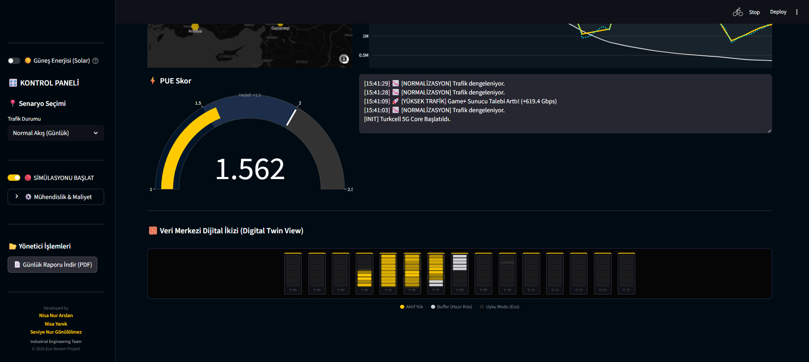
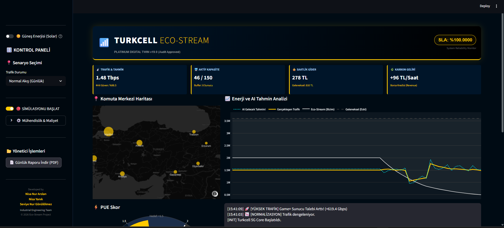
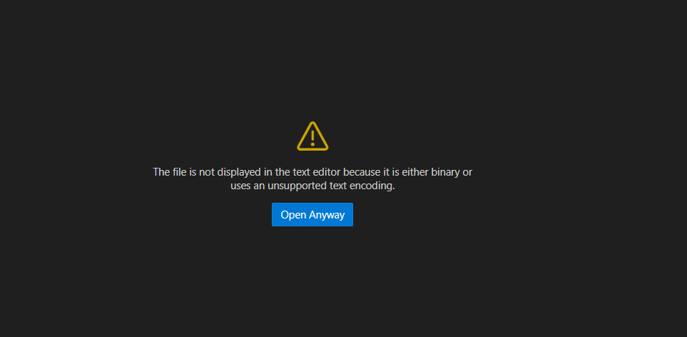

# 🌱 Turkcell Eco-Stream: 5G AI-Powered Digital Twin

> **Turkcell Data Center Operasyonları için Geliştirilmiş Enerji Optimizasyon ve Dijital İkiz Prototipi.**

**Eco-Stream**, endüstriyel veri merkezlerinde enerji tüketimini minimize ederken servis kalitesini (SLA) koruyan, yapay zeka destekli bir simülasyon ve karar destek sistemidir. Proje, Turkcell'in sürdürülebilirlik hedefleriyle tam uyumlu olarak **Hibrit Enerji (Solar + Şebeke)** ve **Dinamik Kapasite Yönetimi** sunar.

## 📸 Simülasyon Görüntüleri

### 1. 🖥️ Genel Yönetim Paneli (Main Dashboard)
Sistemin anlık durumunu, trafik akışını ve sunucu doluluk oranlarını gösteren ana ekran.

---

### 2. ⚡ Akıllı Senaryo Modları
Sistem, değişen koşullara göre kendini otomatik optimize eder:

| ⚽ Derbi Modu (Yüksek Trafik) | ☀️ Solar Mod (Enerji Tasarrufu) |
| :---: | :---: |
|  |  |
| *Ani trafik artışlarında buffer oranını artırarak kesintiyi önler.* | *Güneş enerjisi devreye girdiğinde şebeke kullanımını minimize eder.* |
*(Simülasyon Ekranı: Anlık Trafik Akışı, Güneş Enerjisi Verimi ve Kabin Isı Haritası)*

---

## 🚀 Projenin Amacı

Veri merkezleri, küresel elektrik tüketiminin önemli bir kısmından sorumludur. Bu proje şu kritik sorunlara mühendislik çözümleri üretir:
1.  **Atıl Enerji İsrafı:** Trafiğin düşük olduğu saatlerde gereksiz çalışan sunucuları tespit edip "Derin Uyku" moduna almak.
2.  **Karbon Ayak İzi:** Güneş enerjisi entegrasyonu ile karbon salınımını düşürmek ve bunu finansal getiriye (Karbon Kredisi) dönüştürmek.
3.  **Kriz Yönetimi:** **Derbi Maçları** veya **Siber Saldırılar** gibi ani trafik artışlarında "Tasarruf" modundan çıkıp "Performans" moduna otomatik geçiş yapmak.

---

## 🛠️ Temel Özellikler

### 1. 🌡️ Dijital İkiz (Digital Twin) Görünümü
Fiziksel sunucuların anlık durumunu (Aktif, Buffer, Uyku) görselleştiren LED destekli kabin (rack) simülasyonu.

### 2. 🤖 AI Destekli Trafik Tahmini
Geçmiş verileri analiz ederek gelecek 10 dakikalık yükü tahmin eder ve sunucuları talep gelmeden önce hazırlar (Predictive Scaling).

### 3. ☀️ Hibrit Enerji & Finansal Analiz
* **Solar Mod:** Güneş enerjisi entegrasyonu ile şebeke maliyetlerini %20'ye kadar düşürür.
* **Karbon Kredisi:** Tasarruf edilen CO2 miktarını borsa değerine (Euro/Ton) göre finansal getiriye dönüştürür.

### 4. 🛡️ Akıllı Senaryo Simülasyonu
* **⚽ Derbi Modu:** Ani trafik artışlarını simüle eder, buffer oranını güvenlik için %40'a çıkarır.
* **🚨 Siber Saldırı:** Güvenlik protokollerini devreye alır, sistemi korumaya alır.

---

## ⚙️ Mühendislik Yaklaşımı

Bu proje sadece bir arayüz değil, arkasında endüstri mühendisliği prensipleri barındırır:
* **Newton'un Soğuma Yasası:** Sunucular kapansa bile soğutma maliyetinin anında düşmeyeceğini hesaplayan fizik motoru.
* **Buffer Stock (Güvenlik Stoğu):** Talep belirsizliğine karşı dinamik kapasite planlama.
* **Wear Leveling:** Donanım ömrünü uzatmak için sunucuları dönüşümlü çalıştırma algoritması.

---

## 👥 Takım Üyeleri

* **Nisa Nur Arslan** - Project Lead 
* **Nisa Yanık** - Project Member
* **Seviye Nur Gönülölmez** - Project Member

---

###### ⚠️ Disclaimer: Bu proje yarışma kapsamında geliştirilmiş bir prototiptir. Kullanılan veriler ve AI tahmin modelleri simülasyon amaçlıdır.
